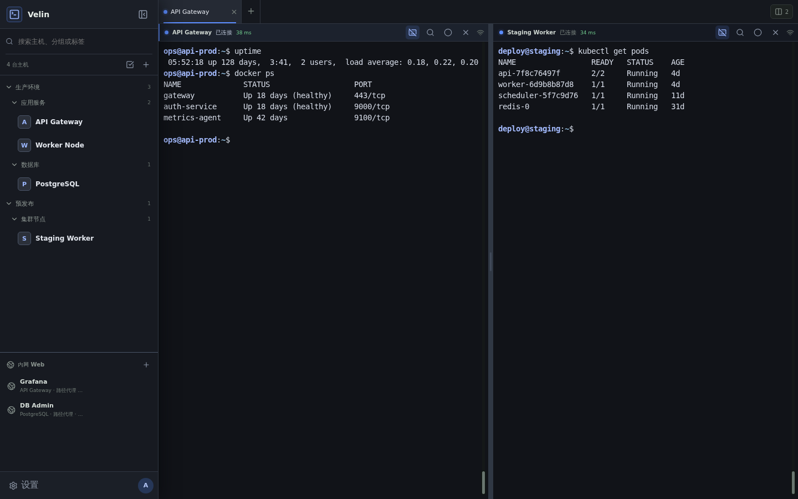

<div align="center">

# Velin Web SSH

轻量、自托管的浏览器 SSH 工作区。

在一个界面中管理主机、终端、文件、端口转发和内网 Web 服务。

[](https://github.com/ttyob/VelinWebSsh/actions/workflows/container.yml)
[](https://github.com/ttyob/VelinWebSsh/releases)
[](https://github.com/ttyob/VelinWebSsh/pkgs/container/velinwebssh)

</div>



## 功能

- 主机分组、搜索、拖动排序、跳板机和 OpenSSH 配置导入
- 多标签与分屏终端，支持普通 SSH、tmux 持久会话和断线恢复
- 连接过程直接显示在终端中，并显示连接状态与网络延迟
- SFTP 文件管理、文本编辑、上传和下载
- 本地、远程与 SOCKS5 端口转发
- 通过 SSH 访问内网 HTTP/HTTPS 服务
- 独立保存的主机密码和可复用 SSH 凭据
- TOTP、PIN 锁屏、主机指纹校验和加密备份
- 主机资源监控、Docker/Git 工具和可选 AI Agent
- Linux Web 版和 Windows Wails GUI

## 快速安装

需要 Linux、Docker Engine 和 Docker Compose v2：

```bash
curl -fsSL https://raw.githubusercontent.com/ttyob/VelinWebSsh/main/install.sh | sh
```

当前用户没有 Docker 权限时：

```bash
curl -fsSL https://raw.githubusercontent.com/ttyob/VelinWebSsh/main/install.sh | sudo sh
```

安装脚本会拉取 `ghcr.io/ttyob/velinwebssh:latest`，创建数据目录和随机管理员密码。完成后会输出访问地址、管理员账号、密码和安装目录。

默认端口为 `8377`，默认安装目录为：

- root 用户：`/opt/velin`
- 普通用户：`~/.local/share/velin`

升级已安装实例：

```bash
/opt/velin/update.sh
```

## 其他运行方式

### Docker Compose

```bash
git clone https://github.com/ttyob/VelinWebSsh.git
cd VelinWebSsh
cp .env.example .env
docker compose build
docker compose run --rm --no-deps --user root --entrypoint sh velin \
  -c 'chown -R velin:velin /app/data && chmod 700 /app/data'
docker compose up -d
```

启动前请修改 `.env` 中的 `VELIN_ADMIN_PASSWORD`。数据保存在项目的 `data/` 目录中。

常用命令：

```bash
docker compose ps
docker compose logs -f velin
docker compose restart velin
docker compose down
```

### GitHub Release

[Releases](https://github.com/ttyob/VelinWebSsh/releases) 提供以下运行包：

- `velin-linux-web-amd64.tar.gz`
- `velin-linux-web-arm64.tar.gz`
- `velin-windows-gui-amd64.zip`

Linux 包解压后复制配置并运行：

```bash
cp .env.example .env
chmod +x velin-web
./velin-web
```

Windows GUI 需要 Microsoft Edge WebView2。解压后在 PowerShell 中执行：

```powershell
.\Velin-GUI.exe
```

Windows GUI 无需配置，默认自动选择空闲本机端口。数据库、主密钥、录制文件和启动日志均写入 `Velin-GUI.exe` 所在目录；需要覆盖默认值时才从 `.env.example` 创建 `.env`。

## 配置

Velin 默认读取运行目录中的 `.env`，同名系统环境变量优先。

| 变量 | 默认值 | 说明 |
| --- | --- | --- |
| `VELIN_ADDR` | `0.0.0.0:8377` | Web 服务监听地址 |
| `VELIN_ADMIN_USER` | `admin` | 首次启动创建的管理员账号 |
| `VELIN_ADMIN_PASSWORD` | 空 | 首次启动管理员密码 |
| `VELIN_DATA_DIR` | `data` | 数据库、主密钥和录制目录 |
| `VELIN_COOKIE_SECURE` | `false` | HTTPS 部署时设置为 `true` |
| `VELIN_HOST_PORT_ADDR` | `127.0.0.1` | 主机端口代理监听地址 |
| `VELIN_AI_BASE_URL` | 空 | OpenAI 兼容 API 地址 |
| `VELIN_AI_MODEL` | 空 | AI Agent 模型名称 |
| `VELIN_AI_API_KEY` | 空 | AI API Key |
| `VELIN_FFMPEG_BINARY` | `ffmpeg` | 终端录制使用的 FFmpeg 路径 |

公网部署请使用 Caddy、Nginx 等反向代理提供 HTTPS，并设置 `VELIN_COOKIE_SECURE=true`。

## 数据与备份

`data/` 目录包含：

- `velin.db`：用户、主机、会话和设置
- `master.key`：SSH 敏感数据的加密主密钥
- `recordings/`：终端录制
- `crush/`：可选 AI 后端数据

管理员可以在设置中创建密钥加密备份。备份包含数据库和 `master.key`，不包含 `.env`、终端录制和 Crush 数据。恢复时必须使用创建备份时输入的同一密钥。

## 开发

需要 Go 1.24、Node.js 18.20.4 或更高版本，以及 npm。

```bash
cd web
npm ci
npm run dev
```

检查和构建：

```bash
cd web
npm test
npm run typecheck
npm run build
```

Windows GUI 使用 Wails 构建：

```powershell
go install github.com/wailsapp/wails/v2/cmd/wails@v2.10.2
wails build -platform windows/amd64 -clean -m -s -skipbindings
```

Windows GUI 默认为便携模式。数据库、主密钥、终端录制和 `velin-gui.log` 均保存在 `Velin-GUI.exe` 所在目录；首次启动生成的管理员账号和随机密码会写入 `velin-gui.log`。

## 常见问题

- `ssh: unable to authenticate`：检查用户名、密码、私钥和远端 SSH 认证策略。
- `tmux session not found`：远端会话已经不存在；也可以把主机会话模式改为普通 SSH。
- 无法启动：检查端口占用、数据目录权限以及 `docker compose logs -f velin`。
- Windows GUI 异常：查看 `Velin-GUI.exe` 同目录下的 `velin-gui.log`。

发布版本与校验文件见 [GitHub Releases](https://github.com/ttyob/VelinWebSsh/releases)。
