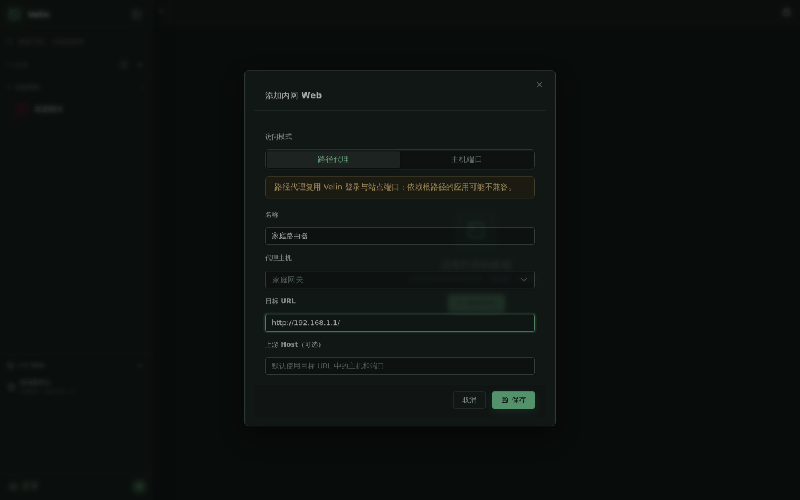

# Velin Web SSH

**轻量、自托管的浏览器 SSH 工作区**

在浏览器中管理主机、终端、文件、端口转发和内网 Web 服务。

## 功能

- **主机管理**：分组、嵌套分组、收藏、搜索、标签、批量操作和 OpenSSH 配置导入
- **主机操作**：双击连接，右键直接打开该主机的三点操作菜单，可编辑、复制、删除、测试连接或访问内网 Web
- **拖动整理**：拖动主机调整同组顺序，或直接拖入其他分组完成移动
- **终端工作区**：多标签、分屏、普通 SSH、tmux 持久会话和断线重连
- **连接体验**：点击连接后立即打开终端，SSH 建连、认证、主机指纹和错误信息在终端内持续显示
- **连接检测**：显示连接状态和网络延迟，延迟颜色会根据数值自动变化
- **文件管理**：SFTP 浏览、上传、下载、重命名，以及带行号和语法高亮的文本编辑
- **网络工具**：本地、远程和动态 SOCKS5 端口转发
- **内网 Web**：通过 SSH 主机代理访问 HTTP/HTTPS 服务，支持路径代理和主机端口模式
- **后台 Agent**：通过独立 SSH 通道进行资源查看、进程管理和 AI 对话，命令执行需要确认
- **安全控制**：加密保存 SSH 凭据、TOTP 两步验证、6 位 PIN 锁屏和主机指纹校验
- **轻量部署**：Go 后端、Vue 前端和 SQLite 数据库，支持 Linux <code>amd64</code>、<code>arm64</code>

## 界面预览

  
   
  通过 SSH 主机访问内网 Web 服务，支持路径代理与独立主机端口

## 快速安装

运行环境：

- Linux <code>amd64</code> 或 <code>arm64</code>
- Docker Engine
- Docker Compose v2 插件
- 能够访问 GitHub Container Registry 的网络环境

执行安装脚本：

~~~bash
curl -fsSL https://raw.githubusercontent.com/ttyob/VelinWebSsh/main/install.sh | sh
~~~

当前用户没有 Docker 权限时：

~~~bash
curl -fsSL https://raw.githubusercontent.com/ttyob/VelinWebSsh/main/install.sh | sudo sh
~~~

脚本会下载发布版 Compose 配置、拉取镜像、创建数据目录并启动服务。首次安装会生成 <code>.env</code> 和随机管理员密码，并在脚本结束时显示：

- 访问地址，默认端口为 <code>8377</code>
- 管理员账号，默认是 <code>admin</code>
- 初始密码
- 安装目录和升级命令

默认安装目录：

- root 用户：<code>/opt/velin</code>
- 普通用户：<code>~/.local/share/velin</code>

首次登录后请立即修改管理员密码并配置 TOTP。

指定版本或安装目录：

~~~bash
curl -fsSL https://raw.githubusercontent.com/ttyob/VelinWebSsh/main/install.sh | VELIN_VERSION=v0.1.0 sh
curl -fsSL https://raw.githubusercontent.com/ttyob/VelinWebSsh/main/install.sh | VELIN_INSTALL_DIR=/srv/velin sh
~~~

> <code>install.sh</code> 使用的版本标签应与 GitHub Releases 中的发布版本一致。已有安装目录中的 <code>.env</code> 会被保留，不会自动重新生成管理员密码。

## Docker Compose 部署

源码仓库中的 <code>compose.yaml</code> 用于本地构建：

~~~bash
git clone https://github.com/ttyob/VelinWebSsh.git
cd VelinWebSsh
cp .env.example .env
~~~

编辑 <code>.env</code>，至少设置一个强管理员密码，然后构建并启动：

~~~bash
docker compose build
docker compose run --rm --no-deps --user root --entrypoint sh velin \
  -c 'chown -R velin:velin /app/data && chmod 700 /app/data'
docker compose up -d
~~~

发布版镜像可以直接使用 <code>compose.release.yaml</code>：

~~~bash
docker compose -f compose.release.yaml up -d
~~~

两个 Compose 配置都使用 host network。Web 服务默认监听 <code>0.0.0.0:8377</code>，主机端口模式的代理默认只监听 <code>127.0.0.1</code>。

常用运维命令：

~~~bash
docker compose ps
docker compose logs -f velin
docker compose restart velin
docker compose down
~~~

<code>docker compose down</code> 不会删除项目目录中的 <code>data/</code>。

## 从 Release 运行

从 [GitHub Releases](https://github.com/ttyob/VelinWebSsh/releases) 下载对应架构的运行包。Release 包包含 Go 二进制、构建后的前端和配置示例，不需要安装 Go 或 Node.js。

~~~bash
tar -xzf velin-linux-web-amd64.tar.gz
cd velin-linux-web-amd64
cp .env.example .env
chmod 600 .env
~~~

编辑 <code>.env</code> 后启动：

~~~bash
chmod +x velin-web
./velin-web
~~~

默认访问地址为 <code>http://127.0.0.1:8377</code>。生产环境建议使用 systemd 或其他进程管理器，并在前面配置 HTTPS 反向代理。

Windows GUI 发布包使用 Wails 打开原生桌面窗口，内部运行本地 Velin Web 服务，不需要安装 Go 或 Node.js。Windows 需要 WebView2 运行时；系统缺少时程序会提示安装。下载 <code>velin-windows-gui-amd64.zip</code> 并解压后，在 PowerShell 中执行：

~~~powershell
cd .\velin-windows-gui-amd64
Copy-Item .env.example .env
notepad .env
.\Velin-GUI.exe
~~~

程序会直接打开 Velin 桌面窗口。Windows 包包含核心服务和前端文件；终端录制需要另外安装 FFmpeg，并在 <code>.env</code> 中设置 <code>VELIN_FFMPEG_BINARY</code>。可选的 Crush AI 后端也需要单独安装 Windows 版本并设置 <code>VELIN_CRUSH_BINARY</code>。

## 源码开发

要求：

- Go <code>1.24</code> 或兼容版本
- Node.js <code>&gt;=18.20.4</code>
- npm
- 远端 SSH 主机上的 <code>tmux</code>（使用 tmux 持久模式时）

本地前端开发：

~~~bash
cd web
npm ci
npm run dev
~~~

类型检查、单元测试和生产构建：

~~~bash
cd web
npm run typecheck
npm run test
npm run build
~~~

Windows 原生 GUI 开发构建需要安装 Wails CLI，并使用 Wails 构建命令生成正确的桌面构建标签：

~~~powershell
go install github.com/wailsapp/wails/v2/cmd/wails@v2.10.2
wails build -platform windows/amd64 -clean -m -s -skipbindings
~~~

不要直接对 Windows Wails 入口执行 <code>go build</code>；该命令不会注入 Wails 所需的构建标签。

完整容器开发流程：

~~~bash
docker compose build
docker compose up -d
~~~

只更新前端静态文件：

~~~bash
./deploy-frontend.sh
~~~

该脚本不会重启后端或主动中断现有终端。修改 Go 后端或依赖后，需要重新构建容器。

## 主机与认证

新增或编辑主机时，可以选择三种认证方式：

1. **直接输入密码**：密码只属于当前主机，独立加密保存。
2. **已保存凭据**：在设置中创建可复用的 SSH 密码或 SSH 私钥凭据，再由主机选择绑定。
3. **连接时输入**：不保存密码，每次连接时临时输入。

主机单独填写的密码不会自动创建或写入“凭据”列表；它和凭据管理是两条独立路径。只有明确选择“已保存凭据”时，主机才会绑定凭据。

使用 SSH 私钥时，私钥口令在连接时一并使用。没有保存认证信息时，连接会在终端中提示输入临时密码。

### 跳板机

跳板机是主机的连接链路设置，不是凭据绑定关系：

- 目标主机可以选择另一台已保存的主机作为跳板机。
- 跳板机自身必须有可用认证信息：已绑定的凭据，或该跳板机单独保存的密码。
- 目标主机和跳板机可以使用不同的用户名、密码、私钥和端口。
- 跳板机不需要绑定“凭据”对象；只要它自身保存了密码即可。
- 支持多层跳板，但链路最多 8 层，并会拒绝循环引用。
- 删除被其他主机使用的跳板机前，需要先解除引用。

首次连接时，Velin 会显示远端主机指纹。确认指纹后才会继续连接；如果指纹发生变化，应先核对服务器身份，再决定是否信任。

## 主机分组与排序

主机分组支持使用 <code>/</code> 创建层级，例如：

~~~text
生产/华东/数据库
生产/华东/Web
测试
~~~

在左侧主机列表中：

- 拖动主机到另一台主机上方或下方，可调整顺序。
- 拖动主机到分组标题或分组空白区域，可切换分组。
- 分组内按保存的排序值排列；分组名称按字母顺序排列。
- 右键主机行会直接触发该行右侧三点按钮的菜单。
- 批量选择后，可以批量移动分组、添加标签或删除主机。

## 终端会话

默认使用 **tmux 持久模式**。创建连接时会先创建会话记录并打开终端标签，后台继续完成 DNS、TCP、SSH 握手、认证、主机指纹和 tmux 建立。连接过程或失败原因会显示在该终端中，不会让整个界面长时间卡在“等待成功”。

tmux 模式的特点：

- Velin 会在远端创建独立的 tmux session，并在服务重启后尝试重新附着。
- 终端滚动使用 tmux 历史缓冲区，支持较大的回滚范围。
- 远端需要安装并允许当前 SSH 用户执行 <code>tmux</code>。
- 关闭标签时，Velin 会尝试结束对应的远端 tmux session。
- 如果 session 已被远端手动删除，关闭标签可能出现 <code>tmux session not found</code>；这表示远端对象已经不存在，不代表本地标签仍然无法清理。可刷新会话状态或移到后台后重新打开工作区。

普通 SSH 模式不依赖 tmux，但 Velin 服务重启后不能恢复原 SSH 进程。适合不允许安装 tmux 的主机或一次性命令会话。

连接失败时，终端会保留具体阶段和错误文本。主机列表中的“测试连接”还会测量建立 SSH 连接的延迟，并在支持时检查远端 tmux 版本、系统类型和发行版。

## 文件、转发与内网 Web

连接成功后可以使用：

- **SFTP 文件管理**：浏览目录，上传、下载、重命名和编辑文本文件。
- **端口转发**：配置本地转发、远程转发或动态 SOCKS5 转发。
- **内网 Web**：选择有可用 SSH 认证信息的主机，将远端 HTTP/HTTPS 服务代理到浏览器。
- **终端录制**：在终端中录制并保存会话视频；数据保存在 <code>data/recordings/</code>。

主机端口模式监听地址由 <code>VELIN_HOST_PORT_ADDR</code> 控制。默认值 <code>127.0.0.1</code> 只允许 Velin 所在服务器本机访问，调整为其他 IPv4 地址前请确认防火墙策略。

## 后台 Agent 与 AI

后台 Agent 使用独立于浏览器终端的 SSH 连接。它要求主机绑定已保存的 SSH 凭据，不能使用每次连接时临时输入的密码，也不会复用当前终端的交互式认证。

Agent 运行在 Velin 服务端，远端主机无需安装常驻 Agent 或监听端口。它可以提供资源快照、进程列表和 AI 对话；模型提出的 SSH 命令会先显示在界面中，用户明确确认后才执行。

AI 配置可以在设置中修改，也可以通过环境变量提供。可选的 Crush 后端在容器构建时内置，运行时会限制本地执行和文件修改工具，并使用独立数据目录。

## 配置

Velin 默认读取运行目录下的 <code>.env</code>。同名系统环境变量优先级更高。

| 环境变量 | 默认值 | 说明 |
| --- | --- | --- |
| <code>VELIN_IMAGE</code> | <code>ghcr.io/ttyob/velinwebssh:latest</code> | Release Compose 使用的镜像 |
| <code>VELIN_ADDR</code> | <code>0.0.0.0:8377</code> | Web 服务监听地址 |
| <code>VELIN_ADMIN_USER</code> | <code>admin</code> | 首次启动创建的管理员账号 |
| <code>VELIN_ADMIN_PASSWORD</code> | 空或安装脚本生成 | 首次启动管理员密码 |
| <code>VELIN_COOKIE_SECURE</code> | <code>false</code> | HTTPS 部署时设置为 <code>true</code> |
| <code>VELIN_HOST_PORT_ADDR</code> | <code>127.0.0.1</code> | 主机端口模式代理的 IPv4 监听地址 |
| <code>VELIN_DATA_DIR</code> | <code>data</code> | SQLite、主密钥和录制文件目录 |
| <code>VELIN_WEB_DIST</code> | <code>web/dist</code> | 前端静态文件目录 |
| <code>VELIN_AI_BASE_URL</code> | 空 | 兼容 Chat Completions 的模型 API 地址 |
| <code>VELIN_AI_MODEL</code> | 空 | Agent 使用的模型名称 |
| <code>VELIN_AI_API_KEY</code> | 空 | 模型服务 API Key，仅由服务端使用 |
| <code>VELIN_CRUSH_BINARY</code> | <code>/usr/local/bin/crush</code> | Crush 可执行文件路径 |
| <code>VELIN_CRUSH_DATA_DIR</code> | <code>data/crush</code> | Crush 隔离运行数据目录 |
| <code>VELIN_FFMPEG_BINARY</code> | <code>ffmpeg</code> | 终端录制处理使用的 ffmpeg 路径 |

设置 AI 时至少填写 <code>VELIN_AI_BASE_URL</code>、<code>VELIN_AI_MODEL</code> 和 <code>VELIN_AI_API_KEY</code>。使用自定义 OpenAI 兼容服务时，<code>VELIN_AI_BASE_URL</code> 通常填写到 <code>/v1</code>，不要重复追加具体聊天接口路径。

## 升级

一键安装部署：

~~~bash
/opt/velin/update.sh
~~~

自定义安装目录请执行对应目录中的 <code>update.sh</code>。升级脚本会拉取新镜像并使用现有 <code>.env</code>，不会覆盖数据目录。

源码部署：

~~~bash
git pull
docker compose up -d --build
~~~

升级前建议备份 <code>data/</code>。如果需要回滚，应使用与数据库结构兼容的版本并恢复对应的数据备份。

## 数据、安全与备份

默认持久化目录为 <code>data/</code>：

- <code>data/velin.db</code>：用户、主机、分组、会话和设置数据
- <code>data/master.key</code>：SSH 凭据等敏感数据的加密主密钥
- <code>data/recordings/</code>：终端录制文件
- <code>data/crush/</code>：Crush 运行数据
- <code>data/deployment_id</code>：部署实例标识，用于隔离 tmux session

管理员可在设置的“管理”页创建加密备份。备份包含应用数据库和 <code>master.key</code>，使用输入的密钥整体加密。备份密钥至少 12 个字符，通过 Argon2id 派生密钥并使用 AES-GCM 加密；密钥不会写入数据库、环境变量或备份文件。恢复时只需输入创建备份时使用的密钥，恢复前系统会自动生成一份同样加密的当前备份。

备份文件包含恢复数据库所需的 <code>master.key</code>，可以用于跨服务器恢复数据库和已保存凭据。终端录制视频、<code>data/crush/</code> 和 <code>.env</code> 仍不在该备份中；备份文件本身应限制权限。

公网部署建议：

- 使用 Caddy、Nginx 等反向代理提供 HTTPS。
- HTTPS 下设置 <code>VELIN_COOKIE_SECURE=true</code>。
- 通过防火墙限制 <code>8377</code> 和主机端口代理的访问来源。
- 不要把 <code>.env</code>、<code>master.key</code>、SSH 私钥或 AI API Key 提交到 Git。
- 定期更新镜像和管理员密码，并启用 TOTP。

## 故障排查

### <code>ssh: handshake failed: ssh: unable to authenticate</code>

这是 SSH 已经连到目标主机，但服务器拒绝了当前认证方式。常见原因：

- 用户名错误。
- 密码错误或目标账号禁用了密码登录。
- 私钥与服务器中的 <code>authorized_keys</code> 不匹配。
- 私钥需要口令但未填写，或私钥格式不受支持。
- SSH 服务端只允许键盘交互、证书或其他认证方式，而当前连接没有对应凭据。

请先确认主机的用户名、端口和认证方式，再检查远端 <code>sshd_config</code>、账号状态和认证日志。若要临时验证密码，可将主机认证方式改为“连接时输入”；不要为了排错把生产私钥直接粘贴到聊天或日志中。

### <code>tmux session not found</code>

这通常表示远端 tmux session 已经被手工关闭、远端重启，或者服务使用了不同的部署实例标识。关闭标签时 Velin 会将目标不存在视为已结束，并清理本地会话状态；如果旧版本仍停留在列表中，可以刷新页面或重新登录后再关闭。

如果连接本身失败，请确认远端安装了 tmux：

~~~bash
command -v tmux
tmux -V
~~~

也可以在主机设置中把终端会话切换为“普通 SSH”，这样不再依赖 tmux，但服务重启后无法恢复会话。

### 连接长时间等待

现在连接请求会立即打开终端，后台显示连接阶段。若仍然长时间没有结果，优先检查：

- Velin 服务器到目标地址的 DNS、路由和防火墙。
- 主机端口、跳板机链路和连接超时设置。
- 跳板机是否保存了自己的密码或凭据。
- 服务日志：<code>docker compose logs -f velin</code>。
- 主机列表中的延迟和“测试连接”结果。

### 服务无法启动

查看服务状态和日志：

~~~bash
docker compose ps
docker compose logs --tail=200 velin
~~~

常见原因是 <code>8377</code> 已被占用、<code>VELIN_HOST_PORT_ADDR</code> 不是 IPv4 地址、数据目录权限不正确，或 Docker 无法拉取镜像。

## 许可证

项目许可证和发布信息以仓库实际文件及 [GitHub Releases](https://github.com/ttyob/VelinWebSsh/releases) 为准。

---

  Velin Web SSH · 为自托管环境设计

